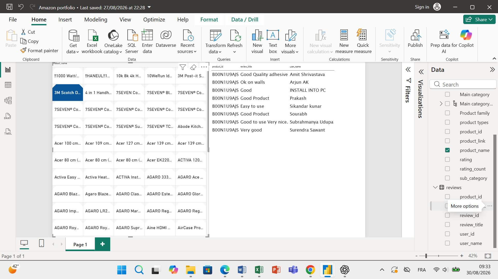
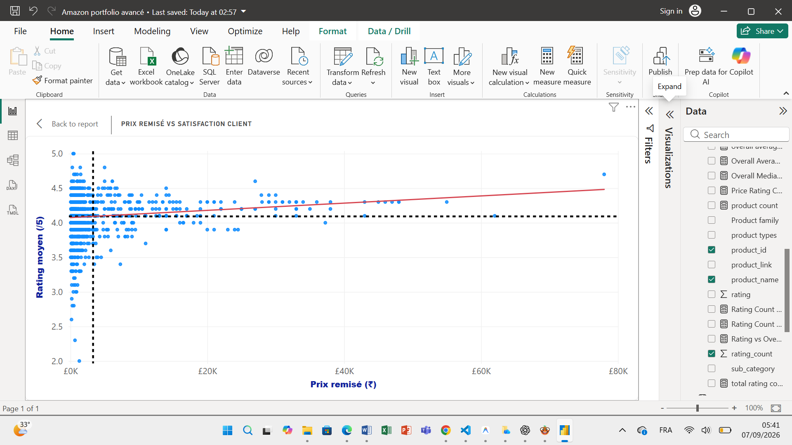

# 🛒 Amazon Price & Product Quality Analysis

### *Analyse de la relation entre remises, satisfaction client et qualité perçue*

---

## 🎯 1. Besoin Métier & Problématique

Les promotions constituent un levier commercial important, mais une réduction de prix ne permet pas à elle seule d'évaluer la qualité réelle d'un produit.

Lorsqu'un produit bénéficie d'une remise importante, il est donc intéressant d'examiner si les données disponibles suggèrent également :

- ⭐ une satisfaction client élevée ;
- 💎 une perception positive de la qualité ;
- 🚀 de bonnes performances ;
- 🛡️ une fiabilité satisfaisante ;
- ⚠️ ou, au contraire, la présence de problèmes récurrents dans les avis.

L'analyse cherche ainsi à étudier conjointement les prix, les remises, les évaluations et le contenu des avis clients afin de mieux comprendre si les produits fortement remisés présentent une satisfaction comparable aux autres produits et quels éléments semblent contribuer à la perception de leur valeur.

> **Remarque méthodologique :** l'objectif n'est pas d'établir une relation causale entre remise et satisfaction, mais d'identifier des **associations, tendances et signaux** observables dans le jeu de données.

---

## 🎯 2. Objectifs du Projet

L'objectif du projet est d'analyser les données produits et les avis clients afin d'étudier la relation entre :

- 💰 **le prix et les remises** ;
- ⭐ **les évaluations moyennes des produits** ;
- 💬 **le contenu des avis clients** ;
- 📊 **le volume d'évaluations** associé aux produits (`rating_count`) ;
- 📝 **le volume d'avis textuels** disponibles dans la table `Reviews`.

L'analyse cherchera notamment à déterminer si les données suggèrent que les produits fortement remisés présentent une satisfaction comparable à celle des produits moins remisés, tout en identifiant les éventuels signaux de faiblesse liés à la qualité, à la performance, à la durabilité ou à la fiabilité.

---

## 🔎 3. Axes d'Analyse

### 3.1 💰 Prix et satisfaction

Étudier la relation entre le niveau de remise, les prix et les évaluations moyennes obtenues par les produits.

L'objectif est d'observer si les produits fortement remisés présentent des niveaux de satisfaction différents de ceux des produits moins remisés.

### 3.2 ⭐ Effet d'aubaine vs qualité intrinsèque

Analyser le contenu des avis clients afin d'examiner si les commentaires positifs semblent davantage associés :

- au prix ;
- au rapport qualité-prix ;
- aux promotions ;

ou aux qualités intrinsèques du produit telles que :

- la performance ;
- la fiabilité ;
- la durabilité ;
- la facilité d'utilisation ;
- la qualité de fabrication.

Cette analyse reste exploratoire et ne cherche pas à établir que la remise cause directement une meilleure ou une moins bonne satisfaction.

### 3.3 📊 Remises et engagement client

Examiner les relations entre :

- le niveau de remise ;
- les évaluations moyennes ;
- le nombre d'évaluations (`rating_count`) ;
- le volume d'avis textuels disponibles.

### 3.4 💬 Identification des signaux de faiblesse

Explorer le contenu des avis afin d'identifier les problèmes récurrents pouvant concerner :

- la qualité ;
- la durabilité ;
- la performance ;
- la fiabilité ;
- les défauts techniques ;
- la conformité du produit ;
- la facilité d'utilisation.

### 3.5 💡 Recommandations

À partir des tendances réellement observées, formuler des recommandations permettant :

- d'identifier les principaux leviers d'amélioration ;
- de détecter les catégories de produits présentant des signaux de faiblesse ;
- de mieux comprendre la place du prix dans la perception de la valeur ;
- d'identifier les caractéristiques intrinsèques les plus souvent associées à la satisfaction.

---

## 🛠️ 4. Préparation et Nettoyage des Données — Power Query

### 📌 4.1 Source et structure initiale des données

Le jeu de données utilisé dans ce projet provient de **Kaggle**.

**Nom du dataset :** `Amazon Sales Dataset`  
**Format :** fichier CSV

#### Structure initiale

- **1 465 lignes**
- **16 colonnes**

Les colonnes initiales sont :

- `product_id`
- `product_name`
- `category`
- `discounted_price`
- `actual_price`
- `discount_percentage`
- `rating`
- `rating_count`
- `about_product`
- `user_id`
- `user_name`
- `review_id`
- `review_title`
- `review_content`
- `img_link`
- `product_link`

Le jeu de données brut regroupe dans une même structure des informations relatives aux produits, aux prix, aux catégories, aux évaluations, aux utilisateurs et aux avis clients.

Plusieurs utilisateurs, identifiants d'avis, titres et contenus pouvaient être associés à un même produit au sein de colonnes concaténées.

Cette structure nécessitait une phase de préparation et de restructuration avant la modélisation.

#### 📸 Structure initiale du jeu de données

.png)

---

### 🔢 4.2 Typage et normalisation des données

#### `actual_price` et `discounted_price`

- Suppression des symboles monétaires (`₹`).
- Nettoyage des caractères empêchant la conversion.
- Conversion vers un type numérique adapté aux données monétaires.

#### `discount_percentage`

- Conversion en **nombre décimal**.
- Exemple : `0.47` correspond à **47 %** lorsque la valeur est formatée en pourcentage dans Power BI.

#### `rating`

- Configuration en **nombre décimal** afin de permettre les calculs de moyenne.

#### `rating_count`

- Configuration en **nombre entier**.
- Cette colonne représente le **nombre d'évaluations associé au produit** dans le dataset.

> `rating_count` ne doit pas être confondu avec le nombre d'avis textuels présents dans la table `Reviews`.

---

### 🔍 4.3 Profilage et contrôle de la qualité des données

Les outils de profilage de Power Query ont été utilisés afin d'identifier :

- les valeurs valides ;
- les valeurs vides ;
- les erreurs ;
- les éventuels doublons ;
- la distribution des principales colonnes.

#### 📸 Contrôle de la qualité des données


#### `rating_count`

Le profilage a identifié **2 valeurs vides**.

Les lignes concernées ont été examinées puis supprimées afin d'éviter d'introduire des valeurs manquantes dans les analyses basées sur le volume d'évaluations.

#### `rating`

Le profilage a identifié **1 valeur en erreur**.

La ligne concernée a été vérifiée puis supprimée.

---

### 🔎 4.4 Identification et traitement des doublons

La distribution de `product_id` a été analysée afin de vérifier si chaque identifiant correspondait bien à une seule ligne produit.

À une étape intermédiaire du nettoyage, le profilage indiquait :

- **1 351 valeurs distinctes** ;
- **1 259 valeurs apparaissant une seule fois**.

La fonctionnalité **Keep Duplicates** de Power Query a été utilisée afin d'isoler les répétitions et de comprendre leur origine.

#### 📸 Identification des doublons via Keep Duplicates


L'analyse a montré que certains `product_id` apparaissaient plusieurs fois avec des informations produit identiques ou très similaires, tandis que les différences concernaient principalement les utilisateurs et les avis.

Cela a confirmé la nécessité de séparer le modèle en deux niveaux de granularité :

- **`Products` : 1 ligne = 1 produit**
- **`Reviews` : plusieurs occurrences d'avis peuvent être associées à un produit**

Après séparation des informations relatives aux avis, les répétitions ont été traitées au niveau de la table `Products` afin de conserver une seule ligne par `product_id`.

#### Résultat final de la table `Products`

- **1 348 produits**
- **1 348 `product_id` distincts**
- **1 348 `product_id` uniques**

La colonne `product_id` constitue ainsi l'identifiant unique de la table `Products`.

> La différence entre les valeurs observées aux étapes intermédiaires et les 1 348 produits finaux résulte de l'ensemble du processus de nettoyage et ne doit pas être attribuée uniquement à la suppression des doublons.

---

### 🗂️ 4.5 Restructuration des catégories

La colonne d'origine `category` contenait plusieurs niveaux de classification concaténés et séparés par le caractère `|`.

Elle a été divisée afin de créer quatre niveaux réutilisables :

- `main_category`
- `sub_category`
- `product_family`
- `product_category`

La cinquième colonne générée par le fractionnement présentait une forte proportion de valeurs vides et a été supprimée.

Les libellés des catégories ont également été harmonisés.

#### 📸 Traitement et séparation des catégories


---

### 💬 4.6 Restructuration des avis clients

Une table dédiée **`Reviews`** a été créée afin de normaliser les informations relatives aux utilisateurs et aux avis.

Les principales étapes ont été :

1. fractionnement des valeurs concaténées de `user_id`, `user_name`, `review_id`, `review_title` et `review_content` ;
2. traitement des colonnes supplémentaires générées lors du fractionnement ;
3. fusion des éléments nécessaires afin de conserver les informations complètes ;
4. **dépivotage (Unpivot)** avec `product_id` comme colonne d'ancrage ;
5. fractionnement de la colonne `Attribute` ;
6. **pivotage (Pivot)** afin de reconstruire les attributs sous forme de colonnes ;
7. suppression des colonnes intermédiaires devenues inutiles ;
8. suppression des lignes vides ;
9. nettoyage des espaces inutiles avec `TRIM`.

#### 📸 Focus technique — Unpivot & Pivot


#### 📌 Granularité de la table `Reviews`

> **1 ligne = 1 occurrence d'avis normalisée associée à un produit et à un utilisateur.**

Un même produit peut donc apparaître plusieurs fois dans la table lorsqu'il est associé à plusieurs avis.

La formulation **« occurrence d'avis normalisée »** est utilisée car le nombre de lignes de `Reviews` et le nombre de `review_id` distincts ne sont pas exactement identiques.

**Volume total : 10 734 lignes.**

#### 📸 Résultat final de la normalisation


---

### 🧠 4.7 Classification exploratoire des avis dans Power Query

Avant le traitement NLP sous Python, deux colonnes d'enrichissement ont été créées dans Power Query à partir de la combinaison :

`review_title + review_content`

Ces classifications reposent sur des **règles lexicales et des mots-clés**.

Elles ne constituent pas un modèle de machine learning ou un modèle NLP entraîné.

#### 🏷️ `review_theme`

La colonne `review_theme` cherche à attribuer un **thème principal** à chaque avis.

Les catégories sont :

- `Defect / Problem`
- `Durability`
- `Price / Value`
- `Ease of Use`
- `Performance`
- `Reliability / Functionality`
- `Quality`
- `General / Other`

La classification est actuellement **mono-thème** : un avis reçoit un thème principal.

L'ordre des règles est donc important lorsqu'un même avis contient plusieurs sujets.

#### 🙂 `review_sentiment`

La colonne `review_sentiment` classe les avis selon quatre catégories :

- `Positive`
- `Negative`
- `Neutral / Mixed`
- `No Review`

Les règles négatives sont évaluées avant les règles positives afin de mieux gérer les commentaires contenant à la fois un terme positif et une plainte claire.

Exemple :

> **Good product but stopped working after two weeks**

Le terme `good` est positif, mais l'expression `stopped working` indique clairement un problème.

Des exceptions ont également été ajoutées afin de réduire certaines erreurs de contexte, par exemple pour éviter de classer **without any issues** comme négatif.

#### ⚠️ Limites de cette classification

Les classifications `review_theme` et `review_sentiment` sont **heuristiques**.

Elles permettent une première exploration, mais peuvent produire des erreurs liées au contexte, à la polysémie ou aux formulations complexes.

Elles seront donc comparées à une approche NLP indépendante sous Python.

---

### 🕒 4.8 Limite temporelle du dataset

Le dataset ne contient pas de colonne de date individuelle associée aux produits, aux évaluations ou aux avis.

Il n'est donc pas possible de réaliser de manière fiable :

- une évolution des notes dans le temps ;
- une analyse mensuelle ou annuelle ;
- une évolution historique des prix ;
- une analyse avant/après promotion ;
- une analyse temporelle des avis.

Les informations de publication ou de mise à jour de la page Kaggle ne doivent pas être utilisées comme date des observations.

Aucune dimension Date artificielle n'a donc été créée.

---

## 📊 5. Modélisation des Données — Power BI Desktop

### 🗂️ 5.1 Structure du modèle de données

Le modèle repose principalement sur deux tables :

- **`Products`** — table de référence des produits ;
- **`Reviews`** — table contenant les occurrences d'avis normalisées.

Une structure dédiée à l'analyse NLP a également été préparée :

- **`Reviews_NLP`** — table destinée à l'export et à l'analyse NLP sous Python.

#### `Products`

**Granularité :**

> **1 ligne = 1 produit**

La table contient **1 348 produits uniques**.

#### `Reviews`

**Granularité :**

> **1 ligne = 1 occurrence d'avis normalisée associée à un produit et à un utilisateur.**

La table contient **10 734 lignes**.

#### `Reviews_NLP`

La table préparée pour Python contient actuellement :

- `product_id`
- `review_id`
- `review_title`
- `review_theme`
- `review_content`
- `review_sentiment`

Elle contient également **10 734 lignes**.

---

### 🔗 5.2 Relation entre les tables

La relation principale repose sur `product_id`.

```text
Products (1) ─────────── (*) Reviews
```

La cardinalité est donc 1-à-plusieurs.

Ainsi :

un produit apparaît une seule fois dans Products ;
un produit peut être associé à plusieurs lignes dans Reviews.

### 📸 Vérification du filtrage entre tables

Un test de filtrage a été réalisé afin de vérifier que la sélection d'un produit dans Products filtre correctement les avis associés dans Reviews.



### 🌳 5.3 Hiérarchie des catégories

Une hiérarchie a été créée dans Products afin de permettre le drill-down :

```text
Main Category
      ↓
Sub Category
      ↓
Product Family
      ↓
Product Category

```

### ⚙️ 5.4 Configuration des propriétés des colonnes
#### Champs monétaires
actual_price
discounted_price

Les montants sont exprimés en roupies indiennes (₹ / INR).

#### Champs numériques
rating → nombre décimal
rating_count → nombre entier
discount_percentage → nombre décimal / pourcentage

#### Identifiants

product_id
user_id
review_id

Ces champs sont conservés comme texte, car ils servent d'identifiants et ne doivent pas être additionnés ou moyennés.

## 🧮 6. Mesures DAX de Référence

Une première série de mesures descriptives a été créée afin de disposer d'indicateurs de référence pour l'analyse.

### ⭐ 6.1 Satisfaction produit
#### Average Rating

```dax
 Average Rating =
AVERAGE(Products[rating])
```
Valeur observée : 4,09 / 5

Cette mesure calcule la moyenne des notes stockées au niveau produit.

Il s'agit donc d'une moyenne non pondérée des notes moyennes des produits : chaque produit contribue de manière identique au calcul.

Une moyenne pondérée par rating_count pourra être étudiée ultérieurement.

### 💰 6.2 Prix et remises
#### Average Actual Price

```dax
 Average Actual Price =
AVERAGE(Products[actual_price])
```

Valeur observée : ≈ ₹5,70 K

#### Average Discounted Price

```dax
Average Discounted Price =
AVERAGE(Products[discounted_price])
```
Valeur observée : ≈ ₹3,31 K

#### Average Discount

```dax
Average Discount =
AVERAGE(Products[discount_percentage])
```
Valeur observée : 47 %

### 📦 6.3 Volume de produits
#### Product Count

```dax
Product Count =
COUNTROWS(Products)
```

Valeur exacte : 1 348 produits

### 📊 6.4 Volume d'évaluations
#### Total Rating Count

```dax
Total Rating Count =
SUM(Products[rating_count])
```
Cette mesure additionne le nombre d'évaluations indiqué pour les produits.

Elle représente un volume d'évaluations agrégé au niveau produit et ne correspond pas au nombre d'avis textuels présents dans Reviews.

#### Average Rating Count

```dax
Average Rating Count =
AVERAGE(Products[rating_count])
```

Valeur observée : ≈ 17,66 K

### 💬 6.5 Avis clients
##### Reviews Count

```dax
Reviews Count =
COUNTROWS(Reviews)
```

Valeur exacte : 10 734 lignes

Power BI peut afficher cette valeur sous forme abrégée : ≈ 11 K.

#### Distinct Review Count

```dax
Distinct Review Count =
DISTINCTCOUNT(Reviews[review_id])
```

Valeur affichée dans Power BI : ≈ 9 K

#### Distinct User Count

```dax

Distinct User Count =
DISTINCTCOUNT(Reviews[user_id])
```
Valeur affichée dans Power BI : ≈ 9 K

### 📌 6.6 Synthèse des mesures de référence

Axe	Mesure DAX	Table	Description	Valeur observée

⭐ Satisfaction	Average Rating	Products	Note moyenne des produits, non pondérée	4,09 / 5
💰 Prix initial	Average Actual Price	Products	Prix moyen avant remise	≈ ₹5,70 K
💰 Prix remisé	Average Discounted Price	Products	Prix moyen après remise	≈ ₹3,31 K
🏷️ Promotion	Average Discount	Products	Taux moyen de remise	47 %
📦 Produits	Product Count	Products	Nombre de produits uniques	1 348
📊 Évaluations	Total Rating Count	Products	Volume total d'évaluations	—
📊 Évaluations	Average Rating Count	Products	Nombre moyen d'évaluations par produit	≈ 17,66 K
💬 Avis	Reviews Count	Reviews	Nombre de lignes d'avis normalisées	10 734
💬 Avis uniques	Distinct Review Count	Reviews	Nombre de review_id distincts	≈ 9 K
👤 Utilisateurs	Distinct User Count	Reviews	Nombre d'utilisateurs distincts	≈ 9 K

## 🧪 7. Validation de la Classification du Sentiment avec Orange Data Mining

La classification `review_sentiment` créée dans Power Query repose sur une approche lexicale déterministe.

Afin d'évaluer sa cohérence par rapport à une interprétation humaine, une phase de validation indépendante a été réalisée avec **Orange Data Mining**.

L'objectif n'était pas d'entraîner un nouveau modèle de sentiment, mais d'évaluer les prédictions déjà produites par Power Query sur un échantillon annoté manuellement.

### 🎯 Méthodologie de Validation

Un échantillon aléatoire reproductible de **400 avis** a été extrait des **10 582 avis normalisés**.

Pour éviter que la classification Power Query influence l'annotation humaine, les colonnes `review_sentiment` et `review_theme` ont été masquées lors de la préparation de l'échantillon.

Chaque avis a ensuite été annoté manuellement à partir de `review_title` et `review_content` selon trois catégories :

- `positive`
- `negative`
- `neutral`

L'annotation manuelle constitue une **référence humaine de validation**, et non une vérité absolue.

Les annotations ont ensuite été réintégrées dans Orange et rapprochées des prédictions Power Query à l'aide de la clé composite :

```text
(product_id, review_id)
```

Cette jointure a permis d'obtenir **400 correspondances sur 400**, sans duplication.

### 🔄 Logique de Validation

```text
10 582 Avis Normalisés
        │
        ↓
Échantillon Aléatoire Reproductible
        │
        ↓
      400 Avis
        │
        ├─────────────────────────┐
        ↓                         ↓
Annotation Humaine         Classification Power Query
manual_sentiment           review_sentiment
        │                         │
        └────────────┬────────────┘
                     ↓
              Merge dans Orange
          (product_id + review_id)
                     ↓
              400 / 400 lignes
                     ↓
             Test and Score
                     ↓
             Confusion Matrix
                     ↓
              Analyse des Erreurs
```

### 📊 Résultats de la Validation

La comparaison entre `manual_sentiment` et `review_sentiment` a produit les métriques suivantes :

| Métrique | Résultat |
|---|---:|
| Accuracy / CA | 0,700 |
| F1 Score | 0,703 |
| Precision | 0,706 |
| Recall | 0,700 |
| AUC | 0,693 |
| MCC | 0,381 |

La classification Power Query présente donc une **concordance globale de 70 % avec la référence humaine** sur l'échantillon de validation.

Sur les 400 avis :

- **280** ont été classés de manière concordante ;
- **120** présentent un désaccord entre la règle Power Query et l'annotation humaine.

### 🧩 Matrice de Confusion

| Réel \ Prédit | Negative | Neutral | Positive | Total |
|---|---:|---:|---:|---:|
| Negative | 23 | 18 | 14 | 55 |
| Neutral | 15 | 28 | 27 | 70 |
| Positive | 17 | 29 | 229 | 275 |
| **Total** | **55** | **75** | **270** | **400** |

La classification reconnaît nettement mieux les avis positifs que les avis négatifs ou neutres.

Le rappel observé par classe est approximativement de :

- **83,3 %** pour les avis positifs ;
- **41,8 %** pour les avis négatifs ;
- **40,0 %** pour les avis neutres.

### 🔎 Analyse des 120 Désaccords

Les **120 avis mal classés** ont été inspectés dans Orange.

Les six types d'erreurs observés sont :

| Erreur | Nombre |
|---|---:|
| Neutral → Positive | 27 |
| Negative → Positive | 14 |
| Positive → Negative | 17 |
| Positive → Neutral | 29 |
| Negative → Neutral | 18 |
| Neutral → Negative | 15 |
| **Total** | **120** |

Les principales causes identifiées sont :

- vocabulaire positif incomplet ;
- vocabulaire négatif incomplet ;
- difficulté à interpréter les avis mixtes ou nuancés ;
- priorité parfois trop forte donnée aux termes négatifs ;
- présence de critiques non couvertes par le lexique ;
- variantes linguistiques, fautes et formulations non prévues ;
- présence de contenus dans d'autres langues ;
- ambiguïté possible de certaines annotations humaines.

### 🧠 Décision Méthodologique

La règle Power Query n'a pas été modifiée après l'analyse de ces erreurs.

Modifier le lexique à partir des erreurs observées puis réévaluer la classification sur les **mêmes 400 avis** risquerait de suradapter les règles à l'échantillon de validation.

Les résultats sont donc conservés tels quels et les limites de la classification seront prises en compte dans l'interprétation des visualisations Power BI.

> Sur un échantillon aléatoire reproductible de 400 avis annotés manuellement, la classification lexicale a obtenu 70 % de concordance avec la référence humaine. L'analyse de la matrice de confusion montre une meilleure reconnaissance des avis positifs que des avis négatifs ou neutres. Les principaux désaccords proviennent des avis mixtes, du vocabulaire non couvert et de l'absence de compréhension contextuelle inhérente à une approche lexicale déterministe.

---

## 📐 8. Analyse DAX

Après la préparation des données et la validation de la classification du sentiment, des mesures DAX ont été développées afin de construire la couche analytique du projet.

### Mesures descriptives

Les mesures de référence comprennent notamment :

- nombre de produits ;
- nombre d'avis normalisés ;
- nombre d'avis distincts ;
- nombre d'utilisateurs distincts ;
- rating moyen ;
- prix initial moyen ;
- prix remisé moyen ;
- remise moyenne ;
- volume total de ratings ;
- volume moyen de ratings.

### Mesures analytiques

Des mesures supplémentaires ont été développées afin d'étudier :

- la part des avis positifs ;
- la part des avis négatifs ;
- la part des avis neutres ou mixtes ;
- le nombre d'avis classés `Defect / Problem` ;
- le taux d'avis classés `Defect / Problem` ;
- les écarts de prix par rapport au benchmark global ;
- les écarts de rating par rapport au benchmark global ;
- les écarts de remise par rapport au benchmark global ;
- le niveau d'engagement par rapport aux références globales ;
- les produits combinant forte remise et rating inférieur à la moyenne ;
- les produits combinant forte remise et rating supérieur à la moyenne.

### 📊 Moyenne et Médiane de l'Engagement

L'analyse de `rating_count` montre une différence importante entre la moyenne et la médiane :

```text
Average Rating Count ≈ 17,66K
Median Rating Count  ≈ 4,74K
```

La moyenne est donc nettement supérieure à la médiane.

Cela indique une distribution asymétrique dans laquelle certains produits disposant d'un très grand nombre de ratings tirent la moyenne vers le haut.

Pour cette raison, la **médiane est également utilisée comme benchmark d'engagement**, car elle représente mieux le niveau central de la distribution.

`rating_count` est interprété comme un **signal d'engagement ou de popularité**, et non comme un volume de ventes.

### Premiers Indicateurs

L'analyse des benchmarks a notamment permis d'identifier :

- **297 produits** combinant une remise supérieure à la moyenne et un rating inférieur à la moyenne ;
- **424 produits** combinant une remise supérieure à la moyenne et un rating supérieur à la moyenne ;
- **559 avis**, soit **5,28 % des 10 582 avis normalisés**, classés dans le thème `Defect / Problem`.

Ces résultats constituent des **signaux analytiques à explorer dans les visualisations** et ne démontrent pas de relation causale.

---

## 📊 9. Visualisations & Analyse Power BI

La phase de visualisation transforme les mesures descriptives et analytiques en analyses permettant d'explorer les relations entre prix, remises, satisfaction, engagement et contenu des avis clients.

Les visualisations sont organisées autour des axes suivants :

1. **Prix et satisfaction**
2. **Effet d'aubaine vs qualité intrinsèque**
3. **Remises et engagement client**
4. **Identification des signaux de faiblesse**
5. **Synthèse et recommandations**

Les résultats sont interprétés comme des **associations, tendances et signaux observés dans le dataset**, et non comme des relations causales.

---

### 9.1 💰 Prix remisé vs satisfaction client

Cette première analyse examine la relation entre le **prix remisé d'un produit** et son niveau de satisfaction, représenté par son `rating`.

Le nuage de points a été construit avec :

- **Axe X :** prix remisé (`discounted_price`)
- **Axe Y :** rating (`rating`)
- **Granularité :** produit (`product_id`)
- **Benchmark vertical :** prix remisé moyen global
- **Benchmark horizontal :** rating moyen global
- **Ligne de tendance :** tendance linéaire globale

Les deux benchmarks permettent de positionner chaque produit par rapport aux valeurs moyennes du dataset :

- **Prix remisé moyen : ≈ ₹3,31K**
- **Rating moyen : 4,09 / 5**

Ces valeurs constituent des **références descriptives propres au dataset** et ne représentent pas des seuils universels de bonne ou de mauvaise performance.

#### 📸 Visualisation



### 9.2 🎯 Discounts & Perceived Value

Cette analyse cherche à déterminer si les remises élevées sont associées à une meilleure satisfaction client, et si les avis positifs semblent davantage liés à un effet d'aubaine (`Price / Value`) ou à des caractéristiques intrinsèques du produit.

La page Power BI dédiée à cet axe contient trois visualisations complémentaires :

1. **Discount vs Customer Satisfaction**
2. **Customer Sentiment by Review Theme**
3. **Positive Reviews by Theme**

---

#### 9.2.1 Discount vs Customer Satisfaction

Un nuage de points a été utilisé pour analyser la relation entre :

- **Axe X :** `discount_percentage`
- **Axe Y :** `rating`
- **Granularité :** produit
- **Benchmark vertical :** remise moyenne globale
- **Benchmark horizontal :** rating moyen global
- **Ligne de tendance :** tendance linéaire globale

Le coefficient de corrélation de Pearson calculé dans Power BI est :

**r = -0,160**

Cette valeur indique une **faible association linéaire négative** entre le niveau de remise et le rating.

Les produits bénéficiant de remises plus importantes tendent légèrement à avoir des ratings plus faibles, mais cette tendance reste faible et la dispersion des observations est importante.

> **Une remise élevée n'est donc pas associée, dans ce dataset, à une satisfaction client nettement supérieure.**

Cette relation reste descriptive et ne permet pas d'établir un lien causal entre remise et satisfaction.

---

#### 9.2.2 Customer Sentiment by Review Theme

Un graphique en barres empilées à 100 % a ensuite été utilisé pour comparer la répartition des sentiments au sein de chaque thème d'avis.

Les principales proportions positives observées sont :

- **Price / Value : 74,03 %**
- **Performance : 62,11 %**
- **Ease of Use : 75,17 %**
- **Reliability / Functionality : 67,52 %**
- **Quality : 72,50 %**
- **Durability : 86,31 %**

À l'inverse, le thème :

- **Defect / Problem : 87,30 % d'avis négatifs**

Le thème `Price / Value` est donc fortement associé à des avis positifs, mais plusieurs caractéristiques intrinsèques du produit présentent également une forte proportion de sentiment positif.

La **durabilité** se distingue notamment avec **86,31 % d'avis positifs** parmi les avis classés dans ce thème.

---

#### 9.2.3 Positive Reviews by Theme

Pour compléter l'analyse des proportions, un second graphique a été créé afin de mesurer le **volume d'avis positifs par thème**.

Le graphique est filtré sur :

- `review_sentiment = Positive`

La catégorie `General / Other` a été exclue de cette visualisation car elle représente une catégorie résiduelle sans thème spécifique identifiable.

Les principaux volumes d'avis positifs sont :

- **Price / Value : 1 824**
- **Performance : 936**
- **Ease of Use : 651**
- **Reliability / Functionality : 499**
- **Durability : 372**
- **Quality : 369**
- **Defect / Problem : 44**

`Price / Value` est donc le **thème spécifique le plus fréquent parmi les avis positifs**.

Cependant, le volume ne doit pas être confondu avec le taux de positivité. Par exemple, `Durability` compte moins d'avis positifs en volume, mais présente une proportion positive plus élevée que `Price / Value`.

---

#### 💡 Conclusion de l'axe

Les résultats ne montrent pas qu'une remise élevée soit associée à une meilleure satisfaction client. La relation entre remise et rating est au contraire légèrement négative et faible :

**r = -0,160**

En revanche, le rapport qualité-prix ressort comme un thème important dans les avis positifs, avec **1 824 avis positifs classés `Price / Value`**.

La satisfaction observée ne semble toutefois pas reposer uniquement sur un effet d'aubaine. Des caractéristiques intrinsèques comme la **durabilité**, la **facilité d'utilisation**, la **qualité**, la **performance** et la **fiabilité** contribuent également fortement aux avis positifs.

> **Le rapport qualité-prix apparaît comme un moteur important de satisfaction perçue, mais la qualité intrinsèque du produit reste également déterminante dans les signaux exprimés par les avis clients.**

Ces résultats doivent être interprétés comme des **associations descriptives**. Les classifications `review_theme` et `review_sentiment` reposent sur une approche lexicale déterministe, validée dans Orange Data Mining sur un échantillon manuel de 400 avis avec **70 % de concordance** avec la référence humaine.


#### 🔎 Observations

Le nuage de points montre une forte concentration des produits dans une plage de ratings située principalement autour de **3,5 à 4,5**.

La ligne de tendance présente une **légère pente positive**, suggérant que les produits dont le prix remisé est plus élevé tendent à obtenir des ratings légèrement supérieurs.

Cependant, la dispersion importante des observations montre que cette relation reste limitée : des produits présentant des niveaux de prix similaires peuvent avoir des ratings différents, et les produits les plus chers ne sont pas systématiquement les mieux notés.

Lors de l'exploration par catégorie, **Home & Kitchen** et **Electronics** apparaissaient particulièrement présentes parmi les produits situés au-dessus du prix remisé moyen. Cette observation reste descriptive et ne permet pas d'attribuer les différences de satisfaction au prix ou à la catégorie.

#### 📐 Corrélation prix remisé / rating

Afin de compléter l'observation visuelle, le coefficient de corrélation de Pearson entre le prix remisé et le rating a été calculé dans Power BI.

**Coefficient de corrélation : r = 0,127**

Cette valeur indique une **faible association linéaire positive** entre les deux variables.

Les produits plus chers tendent donc légèrement à être mieux notés, mais le niveau de prix remisé est **faiblement associé, à lui seul, aux différences de satisfaction observées dans le dataset**.

La corrélation ne démontre pas de causalité : ce résultat ne signifie pas qu'une augmentation du prix entraîne une augmentation de la satisfaction.

#### 💡 Conclusion de l'analyse

> **Le prix remisé et le rating présentent une faible association positive (r = 0,127). Les produits plus chers tendent légèrement à être mieux notés, mais la forte dispersion des observations montre que le prix remisé seul est faiblement associé au niveau de satisfaction.**
La phase actuelle du projet consiste à transformer les mesures descriptives et analytiques en visualisations Power BI.

Les visualisations seront organisées autour des axes suivants :

1. **Prix et satisfaction**
2. **Effet d'aubaine vs qualité intrinsèque**
3. **Remises et engagement client**
4. **Identification des signaux de faiblesse**
5. **Synthèse et recommandations**

Les conclusions seront formulées uniquement après analyse des visualisations finales.

---

## 💡 10. Recommandations — À Venir

Les recommandations finales seront formulées uniquement après :

- la préparation et la normalisation des données ;
- la modélisation Power BI ;
- la validation de la classification du sentiment avec Orange ;
- la création des mesures DAX analytiques ;
- la construction et l'interprétation des visualisations finales.

Elles viseront notamment à identifier :

- les produits ou catégories présentant des signaux de faiblesse ;
- les thèmes les plus fréquemment associés aux avis clients ;
- les catégories concentrant les problèmes ;
- les situations dans lesquelles une remise importante s'accompagne ou non d'une satisfaction élevée ;
- les différences d'engagement entre catégories et produits ;
- les principaux leviers d'amélioration identifiés dans les données.

---

## ⚠️ 11. Limites de l'Analyse

### Absence de données temporelles

Le dataset ne fournit pas de dates individuelles fiables pour les produits ou les avis.

Aucune tendance temporelle fiable ne peut donc être calculée.

### Absence de données de ventes

Le dataset ne fournit pas directement :

- les quantités vendues ;
- le chiffre d'affaires ;
- le taux de conversion.

Il n'est donc pas possible de mesurer directement l'effet d'une remise sur les ventes.

### `rating` au niveau produit

La colonne `rating` représente une note agrégée associée au produit.

Elle n'est pas une note individuelle liée à chaque avis textuel.

### `rating_count` différent du volume d'avis textuels

`rating_count` représente le nombre d'évaluations associé à chaque produit.

Le nombre de lignes de `reviews` représente uniquement les occurrences d'avis textuels disponibles et normalisées dans le dataset.

Ces deux mesures ne doivent donc pas être interprétées comme équivalentes.

### Classification lexicale du sentiment

`review_sentiment` repose sur des règles lexicales déterministes appliquées au titre et au contenu des avis.

La validation sur 400 avis annotés manuellement a montré **70 % de concordance globale**, avec de meilleures performances sur les avis positifs que sur les avis négatifs ou neutres.

Cette variable doit donc être interprétée comme un **signal analytique imparfait**, et non comme une mesure exacte du sentiment réel.

### Classification des thèmes

`review_theme` repose également sur une classification lexicale déterministe.

Un thème principal est attribué à chaque avis selon les mots et expressions détectés.

Cette classification ne constitue pas un modèle NLP entraîné et peut manquer certains contextes ou formulations.

### Référence humaine

`manual_sentiment` a été utilisé sur un échantillon de 400 avis afin d'évaluer `review_sentiment`.

Cette annotation constitue une référence humaine de validation, mais certaines classifications peuvent rester subjectives, notamment pour les avis mixtes.

### Interprétation des relations

Les analyses permettent d'identifier des **associations, tendances et signaux**, mais ne permettent pas, à elles seules, d'établir une relation causale entre :

- promotion et satisfaction ;
- promotion et engagement ;
- prix et satisfaction.

---

## 🧰 12. Outils Utilisés

- **Power Query** — préparation, transformation, nettoyage, normalisation et classifications lexicales
- **Orange Data Mining** — échantillonnage, rapprochement des annotations, validation du sentiment, matrice de confusion et analyse des erreurs
- **Power BI Desktop** — modélisation, analyse et visualisation
- **DAX** — création des mesures descriptives, benchmarks et indicateurs analytiques
- **Excel** — annotation manuelle de l'échantillon de validation
- **Git / GitHub** — documentation et gestion du projet

---

## 📁 13. Structure du Dépôt

```text
amazon-price-product-quality-analysis/
│
├── data/
│   └── amazon.csv
│
├── powerbi/
│   └── Amazon portfolio avancé.pbix
│
├── screenshots/
│   ├── Screenshot (102).png
│   ├── Data_Quality.png
│   ├── Duplicate_identification.png
│   ├── category_split.png
│   ├── unpivot_pivot_process.png
│   ├── reviews_transformation.png
│   └── test_filtre.png
│
└── README.md
```

> La structure du dépôt sera mise à jour si les fichiers de validation Orange et les captures correspondantes sont ajoutés au repository.

---

## 🚧 14. Statut Actuel du Projet

### ✅ Étapes terminées

- Préparation du dataset brut
- Contrôle de la qualité des données
- Traitement des valeurs manquantes et erreurs
- Traitement des doublons au niveau produit
- Restructuration des catégories
- Normalisation des avis clients
- Création des tables `Products` et `reviews`
- Création de la table `reviews_analysis`
- Vérification des relations du modèle Power BI
- Création des mesures DAX descriptives
- Création de `review_theme`
- Création de `review_sentiment`
- Échantillonnage reproductible de 400 avis avec Orange
- Annotation humaine des 400 avis
- Rapprochement des annotations et prédictions Power Query
- Validation de `review_sentiment`
- Analyse de la matrice de confusion
- Analyse des 120 désaccords
- Création des principales mesures DAX analytiques et benchmarks

### 🔄 Étape en cours

- Construction des visualisations Power BI
- Analyse des résultats par produit et catégorie

### ⏭️ Prochaines étapes

- Finalisation des visualisations Power BI
- Interprétation des résultats
- Recommandations métier
- Finalisation du dashboard
- Finalisation du portfolio GitHub

---

## 📈 15. Objectif Final

Le projet vise à construire un tableau de bord Power BI combinant :

**Prix + Remises + Satisfaction + Engagement + Thèmes des avis + Sentiment**

afin d'obtenir une vision structurée des associations entre le positionnement tarifaire des produits, leur niveau d'engagement et les signaux de satisfaction ou d'insatisfaction exprimés dans les avis clients.

L'objectif n'est pas d'établir des relations causales, mais d'identifier des **tendances, segments, anomalies et signaux exploitables pour l'analyse business**.
