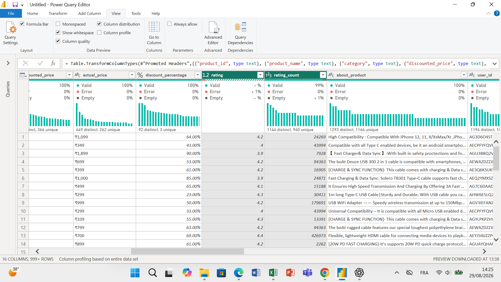
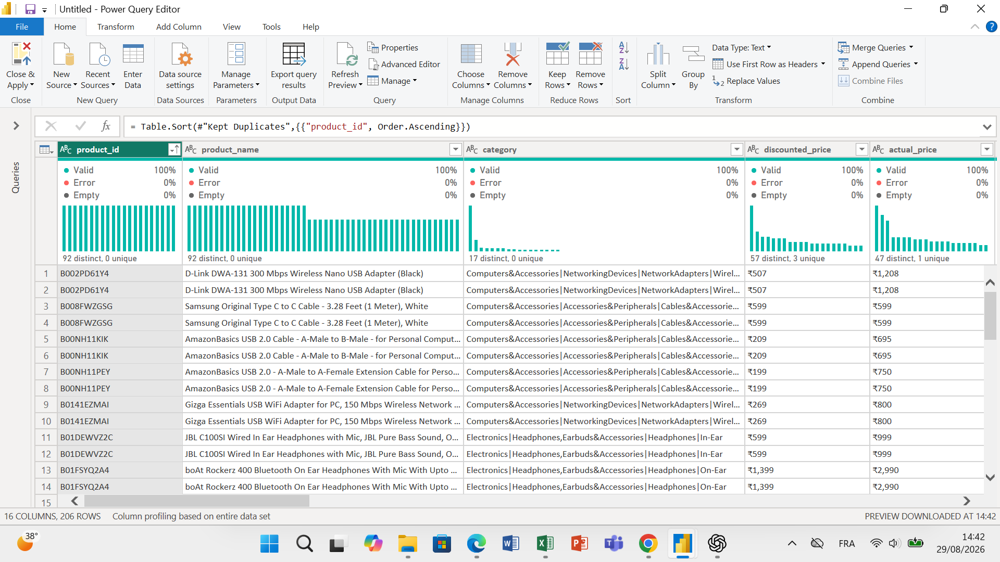
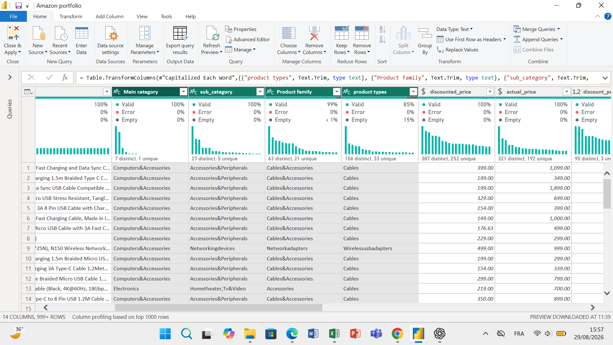
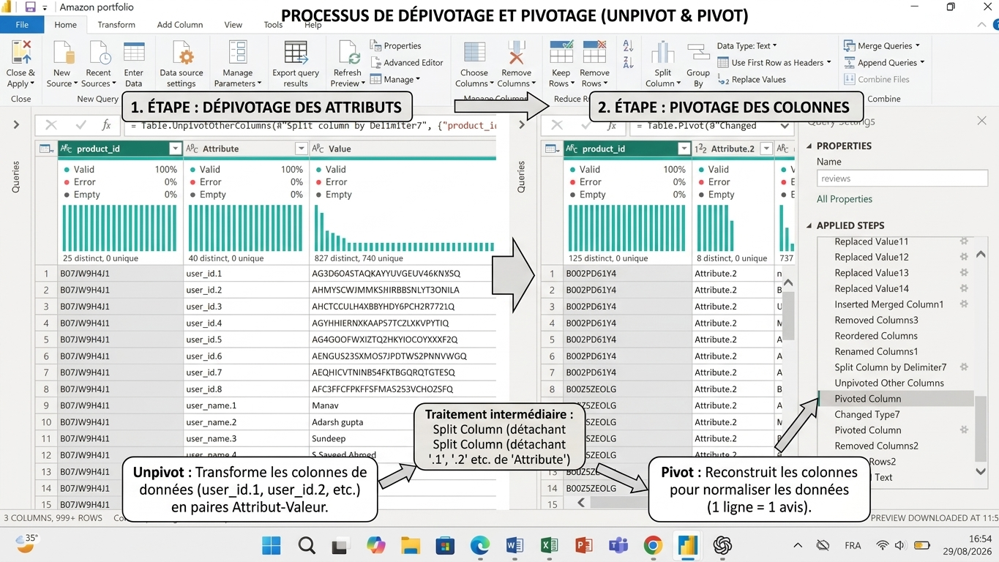
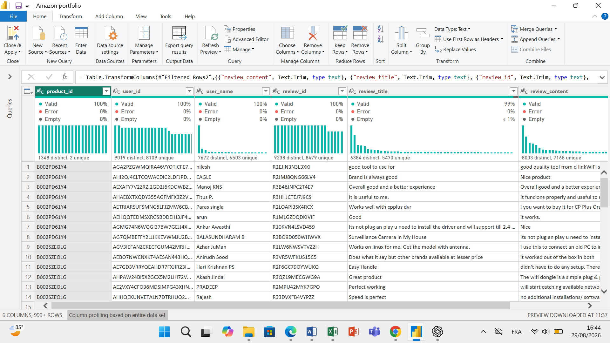

# 🛒 Amazon Price & Product Quality Analysis

## Analyse de la relation entre remises, satisfaction client et qualité perçue

---

## 🎯 Besoin métier et problématique

> **Une promotion ne doit pas masquer une éventuelle faiblesse de la qualité d'un produit. Lorsqu'un produit semble s'appuyer fortement sur les remises pour attirer les clients, il est essentiel d'analyser si ces réductions s'accompagnent également d'une satisfaction réelle en matière de qualité et de performance. Dans le cas contraire, l'analyse devra permettre d'identifier les éventuels problèmes sous-jacents susceptibles d'expliquer cette perception, et d'y apporter des recommandations.**
>
> **Notre analyse visera ainsi à étudier les évaluations et les avis clients afin de déterminer si une note élevée semble davantage refléter un véritable rapport qualité-prix et une satisfaction liée aux qualités intrinsèques du produit, ou si elle pourrait être associée à un simple « effet d'aubaine » lié à la baisse du prix.**

---

# 🎯 Objectif du projet

L'objectif est d'analyser les données produits et les avis clients afin d'étudier la relation entre :

- 💰 le prix et les remises ;
- ⭐ les évaluations des produits ;
- 💬 le contenu des avis clients ;
- 📊 le volume d'avis.

L'analyse cherchera notamment à déterminer si les produits fortement remisés présentent une satisfaction comparable à celle des produits moins remisés, et à identifier les éventuels signaux de faiblesse liés à la qualité ou à la performance.

---

# 🔎 Axes d'analyse

### 1. 💰 Prix et satisfaction

Étudier la relation entre le niveau de remise et les évaluations obtenues par les produits.

### 2. ⭐ Effet d'aubaine vs qualité intrinsèque

Analyser les avis clients afin de rechercher si les évaluations positives semblent davantage associées :

- au prix et au rapport qualité-prix ;
- ou aux qualités intrinsèques du produit : performance, fiabilité, durabilité, facilité d'utilisation, etc.

### 3. 📊 Remises et engagement client

Examiner la relation entre les remises, les évaluations et le volume d'avis afin d'identifier d'éventuelles tendances dans le comportement des clients.

### 4. 💬 Identification des signaux de faiblesse

Explorer le contenu des avis afin d'identifier les problèmes récurrents pouvant concerner :

- la qualité ;
- la durabilité ;
- la performance ;
- la fiabilité ;
- les défauts techniques ;
- la conformité du produit ;
- ou d'autres éléments susceptibles d'influencer la satisfaction.

### 5. 💡 Recommandations

À partir des résultats obtenus, formuler des recommandations permettant d'identifier les leviers d'amélioration potentiels du produit et de mieux comprendre le rôle des promotions dans la perception de la valeur.

---

# 🛠️ 1. Préparation et nettoyage des données — Power Query

## 📌 Source et structure initiale des données

Le jeu de données utilisé dans ce projet provient de **Kaggle**.

**Nom du dataset :** `Amazon Sales Dataset`  
**Format :** fichier CSV  
**Structure initiale :**

- **1 465 lignes**
- **16 colonnes**

Le jeu de données brut regroupe dans une même structure des informations relatives aux produits, aux prix, aux catégories, aux évaluations ainsi qu'aux avis clients.

La structure initiale présentait notamment plusieurs informations d'avis regroupées dans une même ligne, avec plusieurs utilisateurs et plusieurs avis pouvant être associés à un même produit.

Cette organisation nécessitait donc une phase de préparation et de restructuration avant la modélisation.

### 📸 Structure initiale du jeu de données

.png)

---

## 🔢 Typage et normalisation des données

La première étape a consisté à vérifier et adapter les types de données dans Power Query.

### `actual_price` et `discounted_price`

- Suppression des symboles monétaires.
- Conversion du type **Texte** en **nombre décimal fixe**, adapté aux données monétaires.

### `discount_percentage`

- Conversion du type de données en **nombre décimal**.

### `rating`

- Conservation du type **nombre décimal**, déjà adapté aux valeurs de notation.

### `rating_count`

- Conservation du type **nombre entier**.

---

## 🔍 Profilage et contrôle de la qualité des données

Les fonctionnalités de profilage de Power Query ont été utilisées afin d'identifier les valeurs valides, les valeurs vides, les erreurs et les éventuels doublons.
### 📸 Contrôle de la qualité des données



### `rating_count`

Le profilage a révélé environ **1 % de valeurs vides**.

- Identification des lignes concernées.
- Suppression des **2 lignes vides**.

### `rating`

Le profilage a révélé environ **1 % de valeurs en erreur**.

- Identification de la ligne concernée.
- Suppression de la ligne contenant l'erreur.

---

## 🔎 Identification et traitement des doublons

La distribution de `product_id` a initialement montré :

- **1 351 valeurs distinctes**
- **1 259 valeurs uniques**

La fonctionnalité **Keep Duplicates** de Power Query a été utilisée afin d'observer les doublons avant leur suppression.
### 📸 Identification des doublons via la fonction Keep Duplicates




L'analyse des lignes concernées a montré que certains `product_id` apparaissaient deux fois avec des informations produit identiques ou très similaires, notamment :

- le nom du produit ;
- le prix actuel ;
- le prix remisé ;
- le niveau de remise.

Les différences observées concernaient principalement les informations relatives aux avis.

Après vérification, ces lignes ont été considérées comme des doublons au niveau de la table produit.

Les doublons ont donc été supprimés sur l'ensemble des lignes.

Après nettoyage :

- **1 348 valeurs distinctes**
- **1 348 valeurs uniques**

La colonne `product_id` constitue ainsi un identifiant unique dans la table `Products`.

---

# 🗂️ Restructuration des catégories

La colonne initiale `category` contenait plusieurs niveaux de classification concaténés et séparés par le caractère `|`. Elle a été divisée pour créer des axes d'analyse distincts et réutilisables dans le modèle de données.

Exemple de structure :

```text
Main category | Sub category | Product family | Product category | ....
```

### 📸 Traitement et séparation des catégories (Split Column)


Les quatre niveaux pertinents ont été conservés et renommés :

- `main_category`
- `sub_category`
- `product_family`
- `product_category`

La cinquième colonne, présentant une proportion importante de valeurs vides, a été supprimée.

Les noms des catégories ont également été harmonisés afin de garantir une nomenclature cohérente.

## 💬 Restructuration des avis clients

Les informations relatives aux utilisateurs et aux avis étaient regroupées dans une même ligne et pouvaient contenir plusieurs valeurs.

Une table dédiée `reviews` a donc été créée afin de restructurer ces informations.

Les étapes réalisées comprennent :

- Séparation des informations `user_id`, `user_name`, `review_id`, `review_title` et `review_content`.
- Fractionnement des chaînes de caractères à l'aide de délimiteurs.
- Traitement des colonnes supplémentaires générées lors du fractionnement.
- Fusion des éléments nécessaires afin de conserver les informations complètes des avis.
- **Dépivotage** des données avec `product_id` comme colonne d'ancrage.
- Fractionnement de la colonne `Attribute`.
- **Pivotage** de la colonne `Attribute.1` afin de reconstruire les attributs sous forme de colonnes.

  ### 📸 Focus technique : Processus de Dépivotage et Pivotage (Unpivot & Pivot)


- Reconstruction des champs :
  - `user_id`
  - `user_name`
  - `review_id`
  - `review_title`
  - `review_content`
- Suppression des colonnes devenues inutiles après le pivotage.
- Suppression des lignes vides ou ne contenant pas d'informations d'avis.

### 📌 Granularité de la table `reviews`

La restructuration permet d'obtenir le niveau de détail suivant :

> **1 ligne = 1 avis d'un utilisateur sur 1 produit.**

Un même produit peut donc être associé à plusieurs utilisateurs et plusieurs avis.

### 📸 Résultat final de la table reviews (Normalisation)



## 🧹 Nettoyage final

- Suppression des espaces inutiles à l'aide de la fonction `TRIM`.
- Vérification de la cohérence des données textuelles.
- Contrôle de la structure finale des tables `Products` et `reviews`.
- Vérification de la cohérence et de l'intégrité globale du jeu de données.

---

# 📊 2. Modélisation des données — Power BI

Après la préparation et le nettoyage des données dans Power Query, la phase de modélisation a été réalisée dans Power BI Desktop.

L'objectif de cette étape est de structurer les données afin de permettre une analyse fiable des produits, des évaluations et des avis clients.

---

## 🗂️ Structure du modèle

Le modèle repose actuellement sur deux tables principales :

### `Products`

La table `Products` constitue la table de référence des produits.

**Granularité :**

> **1 ligne = 1 produit**

La colonne `product_id` constitue l'identifiant unique du produit.

Après nettoyage, la table contient actuellement **1 348 produits distincts**.

Elle contient notamment les informations relatives :

- aux produits ;
- aux catégories ;
- aux prix ;
- aux remises ;
- aux évaluations ;
- au volume d'évaluations.

---

### `Reviews`

La table `Reviews` contient les informations relatives aux avis clients.

**Granularité :**

> **1 ligne = 1 avis associé à 1 produit et à 1 utilisateur.**

Un même produit peut donc apparaître plusieurs fois dans cette table lorsqu'il possède plusieurs avis.

Les principales informations conservées sont :

- `product_id`
- `user_id`
- `user_name`
- `review_id`
- `review_title`
- `review_content`

Cette structure permettra notamment d'exploiter ultérieurement le contenu textuel des avis.

---

# ⚙️ Configuration des propriétés des colonnes

Après le chargement des données dans Power BI Desktop, les propriétés des colonnes ont été vérifiées et configurées afin de garantir une utilisation cohérente des champs dans le modèle et les visualisations.

Les principaux contrôles ont porté sur :

- le type de données ;
- le format d'affichage ;
- la catégorie de données ;
- les propriétés des champs numériques et textuels.

### 💰 Champs monétaires

Les colonnes :

- `actual_price`
- `discounted_price`

ont été configurées comme des valeurs numériques monétaires afin de permettre leur utilisation dans les calculs et les visualisations.

### 📊 Champs numériques

Les champs numériques ont été vérifiés afin de garantir leur comportement approprié dans les agrégations :

- `rating` → nombre décimal ;
- `rating_count` → nombre entier ;
- `discount_percentage` → nombre décimal / pourcentage selon son utilisation dans le rapport.

### 🔑 Identifiants

Les champs d'identification tels que :

- `product_id`
- `user_id`
- `review_id`

sont conservés comme des champs textuels, car ils servent d'identifiants et non de valeurs destinées à être additionnées ou moyennées.

---

# 🔗 Relation entre les tables

Une relation a été établie entre les deux tables à partir de la colonne `product_id`.

```text
Products (1) ─────────── (*) Reviews
---

### 📸 Vérification du filtrage entre Products et reviews
Un test de filtrage a été réalisé afin de vérifier le fonctionnement de la relation Products → reviews. La sélection d'un produit dans la table Products filtre correctement les avis associés dans la table.

# 📈 3. Analyse — Power BI

*Section à compléter après la modélisation.*

L'analyse portera notamment sur :

- la relation entre prix, remises et évaluations ;
- le rapport entre niveau de remise et volume d'avis ;
- l'analyse des avis clients ;
- l'identification des thèmes associés à la satisfaction et aux éventuelles faiblesses produit ;
- la comparaison entre différents segments de produits.

---

# 💡 4. Recommandations

*Section à compléter après l'analyse des résultats.*

Les recommandations seront formulées à partir des tendances et relations réellement observées dans les données.

---

# 🧰 Outils utilisés

- **Power Query** — préparation, transformation et nettoyage des données
- **Power BI** — modélisation, analyse et visualisation
- **DAX** — mesures et indicateurs analytiques
- **NLP / Text Analysis** — analyse exploratoire du contenu des avis clients

---

# 📁 Structure du projet

```text
amazon-price-product-quality-analysis/
│
├── data/
│   └── dataset
│
├── powerbi/
│   └── amazon_analysis.pbix
│
├── README.md
│
└── screenshots/
    └── portfolio/
